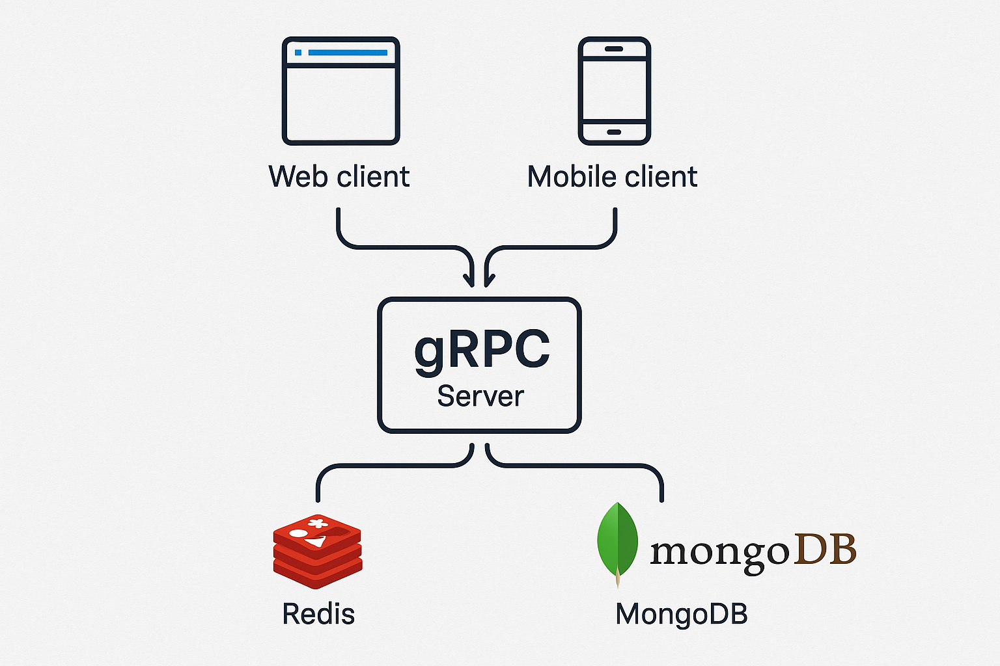

# 🧠 Feature Flags Server con gRPC, Redis y MongoDB

Este proyecto es un **servidor de Feature Flags** multiplataforma basado en **Go**, que permite administrar y consultar flags en tiempo real usando `gRPC`, `Redis` como caché y `MongoDB` como persistencia.

Ideal para entornos `mobile`, `web` o `backend`, y 100% integrable con clientes en `Flutter`, `Android`, `iOS`, `Web`, etc.

## 🚀 Tecnologías

- [x] **Go**
- [x] **gRPC**
- [x] **Protocol Buffers**
- [x] **Redis** (cache + pub/sub)
- [x] **MongoDB** (persistencia)
- [x] **Docker & Docker Compose**

---

## 📌 Características

- ✅ **Crear** feature flags con tipos: `bool`, `string`, `int`, `json`.
- ✅ **Consultar** por clave + entorno + aplicación.
- ✅ **Observar** en tiempo real mediante stream gRPC.
- ✅ **Pub/Sub** con Redis para actualizaciones en vivo.
- ✅ **Persistencia automática en MongoDB**.

---

## 🧪 Ejemplo de Comandos con `grpcurl`

### 📌 Crear un nuevo Feature Flag

```bash
grpcurl -plaintext -d '{
  "feature_key": "dark_mode",
  "app": "mobile",
  "env": "prod",
  "value": { "bool_value": true }
}' localhost:50051 featureflags.FeatureFlags/SetFeature
```

### 🔎 Obtener un Flag

```bash
grpcurl -plaintext -d '{
  "feature_key": "dark_mode",
  "app": "mobile",
  "env": "prod"
}' localhost:50051 featureflags.FeatureFlags/GetFeature
```

### 👂 Escuchar cambios en tiempo real

```bash
grpcurl -plaintext -d '{
  "feature_key": "dark_mode",
  "app": "mobile",
  "env": "prod"
}' localhost:50051 featureflags.FeatureFlags/WatchFeature
```

---

## 🐳 Docker

### 🚀 Construir y correr

```bash
docker-compose up --build
```

Esto levantará:

- El servidor gRPC en el puerto 50051
- Redis en 6379
- MongoDB en 27017

---

## 🧠 Diseño de Arquitectura

- Cliente gRPC envía requests (get/set/watch).

- El Servidor gRPC maneja lógica y persistencia.

- Redis actúa como cache y sistema de pub/sub.

- MongoDB guarda flags con TTL y timestamp.

- Los clientes suscriptores reciben updates en vivo vía stream.

---

## ✍️ Autor

Desarrollado por @frandepy2 — 2025
Proyecto con fines educativos y de escalabilidad real.

---

## 🧩 To-Do Futuro

- [ ]  UI Admin Web para gestión visual

- [ ] Autenticación por token de API

- [ ] Soporte para segmentación de usuarios

- [ ] Multi-tenant real

---

## 🧠 Diagrama de Arquitectura



---

## ⚠️ Licencia

[Licencia MIT](./LICENSE)

MIT © 2025 — Libre para uso y modificación.
